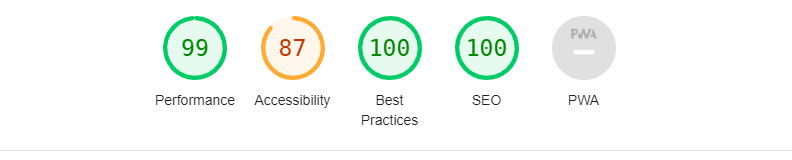

# Rock Paper Scissors Lizard Spock
## Welcome to rock, paper, scissors, liadar and spock Game

This game was created for the needs of 2 projects for the Code Institute.

Rock Paper Scissors Lizard Spock is a recreation of the game from the TV series "The Big Bang Theory".

The game is very simple - the user chooses one of the Rock Paper Scissors Lizard Spock options, then the computer chooses one of the random options.

## Rules of game :

1. Scissors cuts Paper  ✌ > ✋ 
2. Paper covers Rock    ✋ > ✊ 
3. Rock crushes Lizard  ✊ > 🦎 
4. Lizard poisons Spock     🦎 > 🖖 
5. Spock smashes Scissors   🖖 > ✌ 
6. Scissors decapitates Lizard  ✌ > 🦎 
7. Lizard eats Paper    🦎 > ✋ 
8. Paper disproves Spock    ✋ > 🖖 
9. Spock vaproizes Rock     🖖 > ✊ 
10. Rock crushes Scissors   ✊ > ✌

# Content

* [Introduction](# Rock Paper Scissors Lizard Spock)
* [Sections and Pages](#sections-and-pages)
    *  [Header](#header-and-navbar)
    *  [Game Area](#game-area-section)
    *  [Footer](#footer)
* [User Experience](#user-experience)
    *  [User Stories](#user-stories)
* [Design](#design)
    *  [Colour Palette](#colour-palette)
    *  [Typography](#typography)
    *  [Imagery](#imagery)
    *  [Wireframes](#wireframes)
    *  [Accessibility](#accessibility)
* [Technologies Used](#technologies-used)   
    *  [Languages Used](#languages-used)
    *  [Frameworks, Libraries and Programs Used](#frameworks-libraries-and-programs-used)
* [Testing](#testing)
    * [Validator Testing](#validator-testing)
    * [Responsiveness Testing](#responsiveness-testing)
    * [Accessibility Testing](#accessibility-testing)
    * [User Story Testing](#user-story-testing)
* [Bugs](#Bugs)
* [Deployment](#deployment)
* [Credits](#credits)
* [Acknowledgements](#acknowledgements)

## Sections :

* ### Header
 

* The header contains the logo "Rock | Paper | Scissors | Lizard | Spock" in a simple easy-to-read font to announce the game to the user.

* ### Game Area
    We can divide this area into the following elements:
    - Scoring : In this area user will have score displayed player will be displayed in color #FFC300 and computer score will be displayed in color #FF1818
    
    - Options: In this area, the player can select one of the given options by pressing the buttons to win the game , their appearance will be changed after hovering over them with the cursor and distinguish after pressing the button
    
    - Selection: In this area, the user will have their selection and computer selection displayed each off player is assigned a separate color
    
    - Result: This section user will be able to display 1 of 4 game options depending on the state of the game :
    1. Start of Game 
        
    2. Win
    
    3. Lose 
    
    4. Draw
    

    - Reset : Displayed only after starting the game, it is located at the bottom of the game, restarts the game from the beginning 
    
    - Rules : button on the right side of the screen displays the rules of the game when pressed 
    
    

# User Experience
## User Stories 

### Users Goal

- As User, I want to know how to start the game so I can enjoy playing.
- As User, I want to be able to read the rules of the game easily so I understand what I have to do to play.
- As a User, I want to be able to reset the game at any point so I can try again to win

### Goals

- The game is to be accessible to all users with clear descriptions of the images where appropriate
- I want the game to be easy to understand with clear instructions to avoid confusion

- I want the game to be responsive so it can be played on multiple devices.

# Design

## Colour Palette
- The color palette was chosen to provide a simple, easy-to-use game interface. The colors have been chosen to be distinct from each other and will not distract the player 

## Font
- The Roboto font is used throughout the site, making the site easy to read for all visitors.

## Icons
 - The icons have been chosen so that they can be easily and simply selected by the user
# Technologies used
- [GitHub](https://github.com)
- [Gitpod](https://gitpod.io/workspaces)
- [Coolers.co](https://coolors.co)
- [Chrome Dev Tools](https://www.google.com/intl/en_ie/chrome/)
- [Colorhunt](https://https://colorhunt.co/)
- [Fontawesome](https://https://fontawesome.com/icons)

# Testing
The Game  was tested for HTML and CSS validation , responsive design and accessibility using multiple browsers including Chrome, EDGE, and Firefox. Please see screenshots of the results below:

* [W3C Markup Result](https://validator.w3.org/nu/?doc=https%3A%2F%2F8000-azimny86-rockpapersciss-smocz8cwomg.ws-eu79.gitpod.io%2F)
* [W3C CSS Validator](./assets/Images/W3C-CSS.png)

## Chrome
- The Lighthouse report has been run several times for desktop and mobile to evaluate performance, accessibility, best practices, and SEO results.

    -Desktop
    

    -Mobile

## User Story Testing
1. I want the game to be simple with clear instructions to avoid user confusion.
    - The game includes easy-to-understand instructions on how to start the game and how to earn points to win
2. I want the game to be responsiveness
    - The game has been tested on multiple devices for responsiveness. There was an issue on small mobile devices where the content of the buttons was not working, but it has been resolved and fixed. The game displays correctly on tested devices of various sizes.

## User Goals 

1. As a user, I want to know what a game is when I first visit the site so I can decide if I want to start a game.

    - A clear title of the game at the top of the page what the game is about.

2. As a User, I want to be able to easily read the rules of the game to understand what I need to do to win the game

    - The section with the rules of the game is always visible, thanks to which the user has the opportunity to read them before and during the game by pressing the icon

3. As a user, I want to be able to reset the game at any time so I can try to win again

    - After starting the game, a restart button appears in the center of the screen, which is clearly visible and easily accessible to the user to restart the game at any time.

4. As a user, I want to be able to exit the game whenever I have played enough
    
    - There are no blocks allowing the user to quit the game at any time.

# Deployment

The steps to deploy are as follows:

* In the GitHub repository , navigate to the Settings tab
* On the left hand side, locate the Pages section
* From the source section drop-down menu, select the main branch and save
* Once the main branch has been selected, the page will be automatically refreshed with a detailed ribbon display to indicate the successful deployment.

Live page [Live-Page](https://azimny86.github.io/ROCK-PAPER-SCISSORS/)

# Bugs

## Fixed Bugs

 * The scissor button does not respond to pressing adding a pointer-event solved the problem
 * Buttons with options did not deactivate at the end of the game, the reason for this was the lack of the "options" class in the buttons, after adding them the problem disappeared

 ## Known Bugs 
 - The position of the icon in the buttons

 # Credits

 ## Content
  * The icons in buttons in page was taken from [Fontawesome](https://https://fontawesome.com/icons)
  * Content of Game written by developer